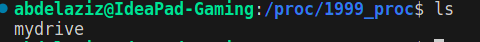

# Procfs Driver

This is a simple Linux kernel module that creates a procfs (proc filesystem) entry named `mydrive`. The procfs entry allows reading from the kernel module.


## PROC Entry 


## Overview
The `operating system` segregates virtual memory into `kernel` space and `userspace`.`Kernel space` is strictly reserved for running the `kernel`, `kernel extensions`, and most `device drivers`.In contrast, `user space` is the memory area where all `user-mode applications work`, and this memory can be swapped out when necessary. 
> :exclamation: There are many ways to Communicate between the Userspace and Kernel Space, one of them is `Procfs`.

## About PROCFS
On the root, there is a folder titled `“proc”`.This folder is a mount point for the `procfs (Process Filesystem)` which is a `filesystem in memory`.
> Many processes store information about themselves on this virtual filesystem.
>> :exclamation: `ProcFS` also stores other system information.
>>> It can act as a `bridge connecting the user space and the kernel space`. Userspace programs can use proc files to `read the information exported by the kernel`. Every `entry` in the proc file system provides some information `from` the kernel.The proc entry can also be used to pass data to the kernel by writing `into` the kernel.

### There can be two kinds of proc entries.

- An entry that only `reads data` from the kernel space.
- An entry that reads as well as `writes data` into and from kernel space.

## Description

The procfs driver creates a virtual file named `mydrive` in the `/proc/1999_proc/` directory. This file supports reading operation.


## Features

- **`Read Operation`**: Reading from the `mydrive` file returns the string "Hello\n".


## Proc Workflow

### 1. Procfs Directory Creation

#### You can create the directory under `/proc/`:

```c
struct proc_dir_entry *proc_mkdir(const char *name, struct proc_dir_entry *parent);
```
**`name`**: The name of the directory that will be created under `/proc`.

**`parent`**: A pointer to the parent directory under `/proc`. If NULL is passed as a parent, the `/proc` directory will be set as the parent.

### 2. Creating Procfs Entry

#### The creation of proc entries can be done using the proc_create function:

```c
struct proc_dir_entry *proc_create(const char *name, umode_t mode, struct proc_dir_entry *parent, const struct file_operations *proc_fops);
```
**`name`**: The name of the proc entry.

**`mode`**: The access mode for proc entry.

**`parent`**: The parent directory under `/proc`. If NULL is passed as a parent, the `/proc` directory will be set as the parent.

**`proc_fops`**: The structure containing the file operations for the proc entry.

### 3. File Operations

create a file_operations structure `(proc_fops)` in which we can map the `read and write` functions for the proc entry.

### 4. Removing Proc Entry

#### Proc entries should be removed in the driver exit function using the following function:

```c
void remove_proc_entry(const char *name, struct proc_dir_entry *parent);
```

## Implementation

The driver is implemented using the following components:

- **Module Initialization**: The `procDriver_INIT` function initializes the driver. It creates a directory named `1999_proc` in the procfs filesystem and then creates a file named `mydrive` within that directory.
- **Read Operation**: The `read_proc` function handles reading from the `mydrive` file. It copies the string `"Hello\n"` to the user space buffer.
- **Module Exit**: The `procDriver_EXIT` function is called when the module is unloaded. It removes the `mydrive` file entry from the procfs filesystem.


## Usage

1. **Generating module**:

```bash
make
```

2. **Module Loading**:

```bash
sudo insmod procDriver.ko
```

3. **Read from mydrive**:

```bash
# Output: Hello
cat /proc/1999_proc/mydrive
```

4. **Module Unloading**:

```bash
sudo rmmod procDriver
```


