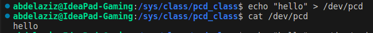
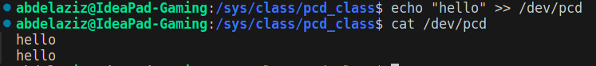

# Pseudo Character Driver

This is a simple Linux kernel module that implements a `pseudo character driver`. It creates a character device `/dev/pcd` that supports reading and writing operations.

## Overwrite 


## Append 


## Description

The driver maintains a pseudo device buffer `device_buffer` of size `DEV_MEM_SIZE` bytes. Users can read from and write to this buffer through the character device.

### File Operations

- **`Open`**: Opens the device file.
- **`Release`**: Closes the device file.
> :exclamation: if you don't provide an open/release function, the kernel will use a default implementation that simply allows the device to be opened/closed without any special actions. It returns success (0) immediately.
- **`Read`**: Reads data from the device buffer.
- **`Write`**: Writes data to the device buffer.

## Implementation

### Global Variables

- `device_buffer`: Pseudo device memory.
- `device_number`: Device number.
- `pcd_cdev`: Character device structure.
- `pcd_class`: Class structure.
- `pcd_device`: Device structure.

### Device Node Permissions

The `pcd_devnode` function sets the device node permissions to 0777.

### Open Function

The `pcd_open` function is called when the device file is opened. It returns 0 to indicate success.

### Release Function

The `pcd_release` function is called when the device file is closed. It returns 0 to indicate success.

### Read Function

The `pcd_read` function reads data from the device buffer into the user space buffer.

### Write Function

The `pcd_write` function writes data from the user space buffer into the device buffer.

### File Operations

The `pcd_fops` structure defines the file operations for the driver.

### Initialization Function

The `pcdDriver_INIT` function initializes the driver. It performs the following steps:

1. Allocates a device number region.
2. Initializes the character device structure with file operations.
3. Registers the character device with the virtual file system (VFS).
4. Creates a device class.
5. Creates a device under the class and populates it with device information.

### Exit Function

The `pcdDriver_EXIT` function is called when the module is unloaded. It performs the following steps:

1. Removes the device.
2. Destroys the class.
3. Deletes the character device.
4. Unregisters the device number.

## Usage

1. **Generating module**:

```bash
make
```

2. **Module Loading**:

```bash
sudo insmod pcdDriver.ko
```

3. **Read from Device**:

```bash
cat /dev/pcd
```

3. **Write to Device**:

```bash
# to overwrite
echo "Data" > /dev/pcd
# to append
echo "Data" >> /dev/pcd
```

4. **Module Unloading**:

```bash
sudo rmmod pcdDriver
```


