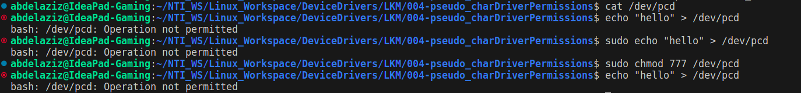

# Pseudo Character Driver Permissions

This is a simple Linux kernel module that adds to the last pseudo character driver. It checks for writing request and reject it even if the command has `sudo` permissions.


## Output 



## Added Check in the Open Function

In the `pcd_open` function, a check has been added to determine if the process is attempting to open the device for writing. If so, the open operation is rejected.

### Implementation

```c
static int pcd_open(struct inode *inode, struct file *filp)
{
    /* Check if the process is opening the device for writing */
    if ((filp->f_flags & O_ACCMODE) == O_WRONLY || (filp->f_flags & O_ACCMODE) == O_RDWR)
    {
        return -1;       
    }

    return 0;   
}
```

### Explanation

`**filp->f_flags`**: This field contains the flags associated with the file object.

`**O_ACCMODE`**: This is a mask that represents the access mode of the file.

`**O_WRONLY, O_RDWR`**: These are constants representing write-only and read-write access modes respectively.
